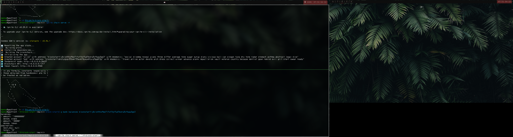
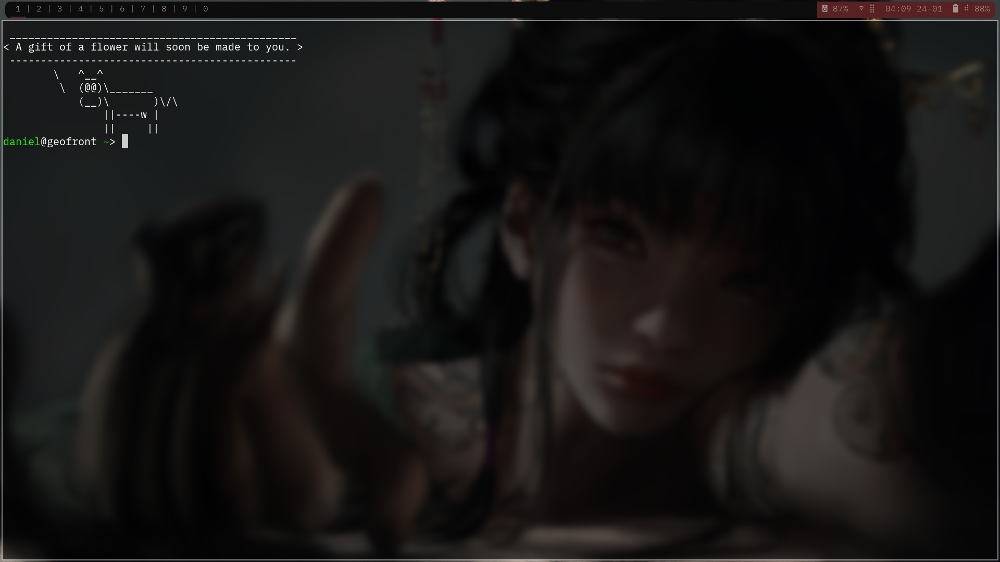

# Danny's Dotfiles

## What I Use:
Status bar: [polybar](https://github.com/polybar/polybar)\
Text editor: [NeoVim](https://github.com/neovim/neovim)\
Tiling window manager: [bpswm](https://github.com/baskerville/bspwm)\
Hotkey daemon: [sxhkd](https://github.com/baskerville/sxhkd)\
Compositor (for the transparent background blur): [picom](https://github.com/yshui/picom)\
Shell: [fish](https://fishshell.com)\
Terminal emulator: [kitty](https://sw.kovidgoyal.net/kitty/)

### Notable packages I installed:
```
bspwm
brightnessctl
clang
cmake
cmake-curses-gui
cowsay
curl
dbeaver-jdk
docker
feh
fish
flameshot
g++
git
gzip
inxi
kitty
make
mpv
neofetch
neovim
pavucontrol
python
rofi
dmenu
thunar
ripgrep
tree
unzip
zip
```

#### Dual Monitor:


#### Single Monitor:

