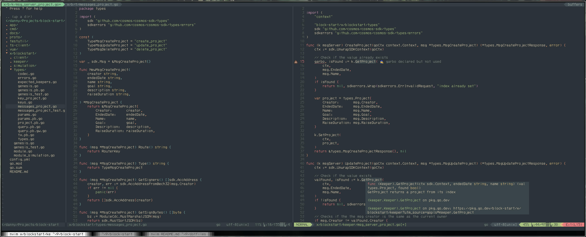

# Danny's Dotfiles

## What I Use

Status bar: [polybar](https://github.com/polybar/polybar)\
Text editor: [NeoVim](https://github.com/neovim/neovim)\
Tiling window manager: [bpswm](https://github.com/baskerville/bspwm)\
Hotkey daemon: [sxhkd](https://github.com/baskerville/sxhkd)\
Compositor (for the transparent background blur): [picom](https://github.com/yshui/picom)\
Shell: [fish](https://fishshell.com)\
Terminal emulator: [kitty](https://sw.kovidgoyal.net/kitty/)

### Other packages I use

```bash
exa
bat
fortune
cowsay
flameshot
```

#### Screenshots

NeoVim setup:


Desktop:

